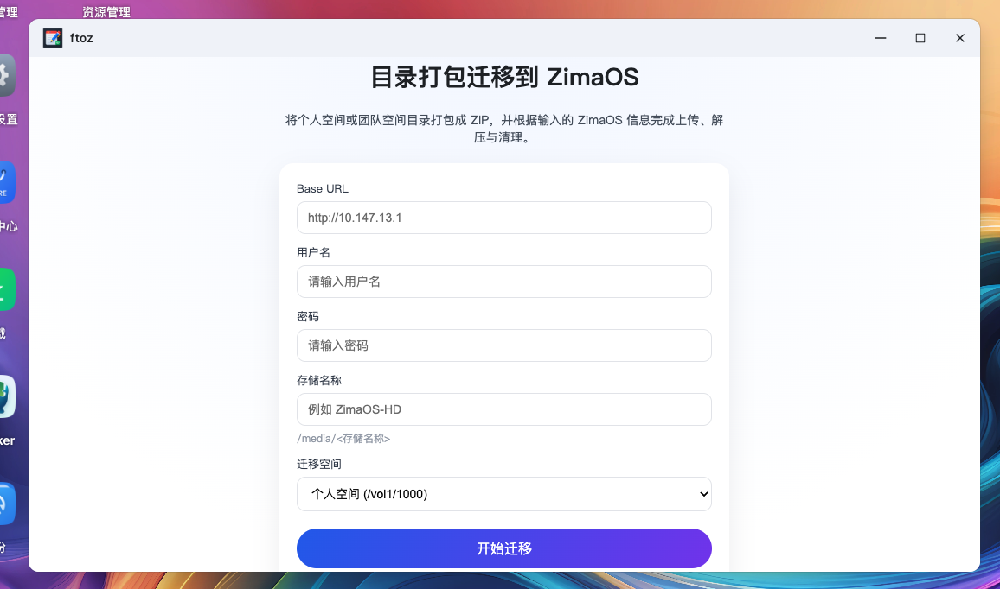

# FTOZ

应用包名：ftoz

显示名称：ftoz


## 应用说明

将本地目录逐个文件迁移到 ZimaOS，支持登录、扫描、上传与进度查询。

[更新日志](CHANGELOG.md)


## 本地运行

> 需要 Node.js 18+（原生 fetch）。

```bash
npm run install
npm run dev:frontend

# 另起 bash
npm run dev:backend
```

## 本地构建

> 请提前安装好 [fnpack](https://developer.fnnas.com/docs/cli/fnpack)，如果不希望打包 fpk，可以执行 build:server

```bash
npm run install
npm run build
```

## 迁移接口

开发环境：

```
POST http://127.0.0.1:17746/migrate
```

部署后（CGI）：

```
POST /var/apps/ftoz/target/server/api?_api=migrate
```

请求体（JSON）：

```json
{
  "baseUrl": "http://<zimaos_host>:<port>",
  "username": "你的用户名",
  "password": "你的密码",
  "storage": "ZimaOS-HD",
  "source": "personal"
}
```

说明：
- `storage` 为空时，上传路径为 `/media`；否则为 `/media/<storage>`
- `source` 取值：`personal`（个人空间 `/vol1/1000`）或 `team`（团队空间 `/vol1/@team`）
- 默认迁移目录为 `/vol1/1000`，可通过设置 `SOURCE_DIR` 环境变量修改

接口采用 SSE 返回实时进度（Content-Type: text/event-stream）。

## 用户使用
！ 现在只支持第一个存储空间
1. 在 FNOS 上安装应用。
点击手动安装 选择编译后的ftoz.fpk文件

2. 填写 `Base URL`、用户名、密码，存储名称可留空。
3. 选择迁移空间（个人空间或团队空间）。
4. 点击“开始迁移”，等待进度完成。

5. 迁移完成后，文件将按原目录结构同步到 `/media/<storage>`（未填写 `storage` 时为 `/media`）。

说明：
- 应用会将 `/vol1/1000` 逐文件迁移，如需变更迁移目录可设置 `SOURCE_DIR` 环境变量。

## 接口调用（可选）

开发调试可直接调用接口：

```bash
curl -X POST 'http://127.0.0.1:17746/migrate' \
  -H 'Content-Type: application/json' \
  -d '{
    "baseUrl": "http://<zimaos_host>:<port>",
    "username": "你的用户名",
    "password": "你的密码",
    "storage": "ZimaOS-HD",
    "source": "personal"
  }'
```

部署后请改为：

```
POST /var/apps/ftoz/target/server/api?_api=migrate
```

## CGI 模式说明

- 服务端：服务端将接口和 node 环境，通过 pkg 打包成 linux 运行文件，在飞牛以 cgi 的方式进行调用和返回。
- 客户端：vite 打包后，将引入文件通过服务端 api 加载
